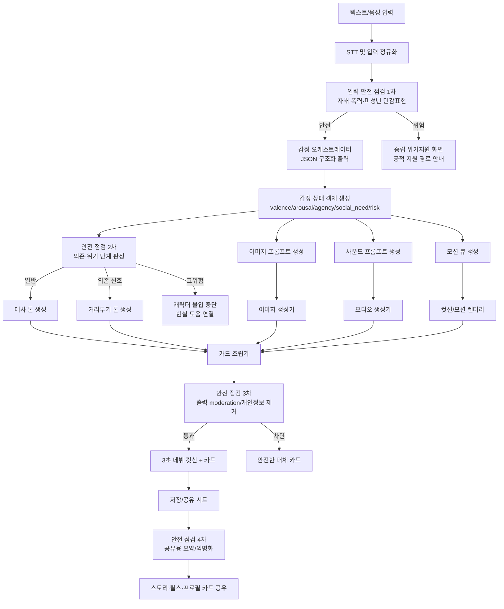
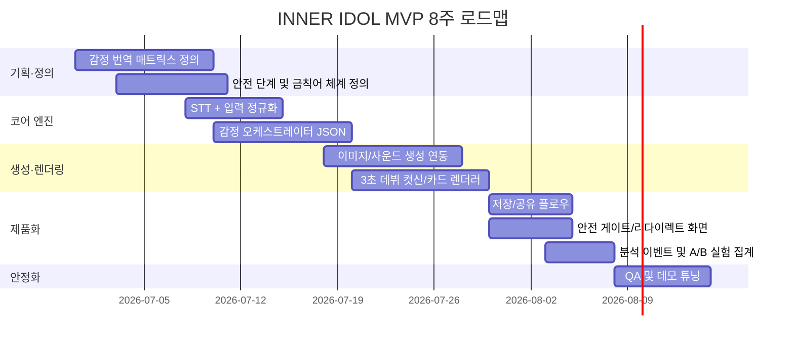

# INNER IDOL를 위한 감정 반응형 AI 아티스트 시스템 보고서

## 경영 요약

INNER IDOL의 핵심 진입점은 “상담이 필요해서 여는 앱”이 아니라 “오늘 내 감정으로 어떤 AI 아티스트가 나올지 궁금해서 여는 앱”이어야 한다. 이 목표를 가장 잘 만족하는 기술 전략은, 사용자의 입력을 곧바로 장문의 위로 대화로 보내는 것이 아니라 **구조화된 감정 상태 객체**로 먼저 바꾸고, 그 객체를 다시 **대사 톤·색 팔레트·사운드 무드·짧은 움직임**으로 번역하는 멀티모달 파이프라인을 두는 것이다. 최근 연구도 이 방향을 지지한다. 감정 이해 쪽에서는 멀티모달 LLM/MLLM이 단순 분류를 넘어 자유서술형 감정 설명과 근거 제시에 가까워지고 있고, 생성 쪽에서는 감정 정렬을 위해 **valence-arousal** 같은 연속 감정 공간을 공통 좌표계로 쓰는 흐름이 강해지고 있다. citeturn24academia0turn24academia1turn49academia0turn26academia2

기술 선택은 “가장 화려한 것”보다 “가장 빨리 공유 가능한 것”에 맞춰야 한다. MVP 기준으로는 텍스트/음성 입력을 받아 감정 상태를 구조화하는 오케스트레이터에 **API형 LLM**을 두고, 이미지 생성은 **GPT Image 2 또는 Gemini 2.5 Flash Image**, 짧은 배경 사운드는 **ElevenLabs SFX 또는 Stable Audio Open**, 움직임은 처음부터 풀 제너레이션으로 가기보다 **프리셋 제스처/2D 컷신 연출 + 필요 시 AnimateDiff-Lightning**으로 시작하는 편이 제품-시장 적합성 탐색에 유리하다. EMAGE·PantoMatrix 같은 홀리스틱 제스처 모델은 강력하지만, 통합 난도가 높고 초기 바이럴 데모에 비해 엔지니어링 소모가 크다. citeturn47view3turn47view2turn31view0turn32view5turn19view1turn21view3turn23academia2turn35view3

UX의 핵심은 세 가지다. 첫째, **초저마찰 입력**이다. 감정 단어 하나, 짧은 문장 하나, 혹은 5초 음성 한 번이면 충분해야 한다. 둘째, **3초 내 보상**이다. 결과는 긴 텍스트가 아니라 즉시 등장하는 “데뷔 컷신”과 1~3장의 카드여야 한다. 셋째, **공유 가능한 안전한 산출물**이다. 공유 카드에는 개인 고백 원문이 아니라 무드명, 색, 짧은 문장, 짧은 사운드, 움직임이 담겨야 한다. 이것이 청소년 자발 진입과 스토리 공유를 동시에 만든다. 이 제품은 “AI가 너를 계속 이해해준다”는 환상을 강화해서는 안 되고, 오히려 “내 감정을 예쁘고 짧게 바깥으로 보여주는 도구”여야 한다.

안전 설계는 별도 부속 기능이 아니라 핵심 아키텍처다. 최소한 네 곳에서 게이트가 필요하다. 입력 직후의 위험 탐지, 감정 구조화 직후의 의존/위기 단계 판정, 생성 직전의 프롬프트 차단, 공유 직전의 개인정보/위험 문구 제거다. 상용 안전 도구도 자기손상·자살 의도·자해 지시·미성년 성적 콘텐츠 같은 범주를 지원하며, 이는 청소년 대상 제품에서 매우 중요한 기반이 된다. 한국에서는 출시 전 법무 검토 범위에 **개인정보보호법**, **청소년복지지원법**, **자살예방 및 생명존중문화 조성을 위한 법률**을 포함시키고, 위기 상황에서는 최소한 **국립정신건강센터** 및 **청소년1388** 같은 공적·공공성 경로로 연결되는 UX를 넣어야 한다. citeturn37view1turn37view2turn37view3turn11view0turn28view1turn28view0turn11view2turn11view1

예산과 컴퓨팅 제약이 명시되지 않았다는 전제에서, 가장 현실적인 권고안은 **중간 시나리오**다. 2~3명의 엔지니어, 1명의 디자이너/모션 아티스트, 8~10주로 “감정 입력 → 3초 데뷔 컷신 → 카드 저장/공유 → 안전차단/위기연결”까지 완성하는 데모를 만드는 것이다. 이 데모가 검증해야 할 지표는 상담 품질이 아니라 **자발적 진입률, 첫 세션 완주율, 저장률, 공유율, 24시간 후 기억 잔존율**이다. 이 네 가지가 오른다면, 그다음부터 정교한 기억 시스템·개인화 학습·모션 생성 고도화로 가면 된다.

## 최근 연구와 기술 시사점

### 멀티모달 감정 AI가 어디까지 왔는가

최근 3년의 핵심 변화는 감정 AI가 더 이상 “행복/슬픔/분노” 같은 닫힌 분류만 하지 않는다는 점이다. 2024년 AffectGPT는 멀티모달 감정 인식에 **설명 가능한 서술**을 결합하는 방향을 제시했고, 2026년 Emotion-LLaMAv2/MMEVerse는 12개의 공개 감정 데이터셋을 하나의 멀티모달 인스트럭션 포맷으로 묶어 감정 인식과 자유서술형 감정 추론을 함께 다루는 벤치마크를 제안했다. 제품 관점에서 이 흐름이 중요한 이유는, INNER IDOL이 필요한 것이 “정답 감정 분류기”보다 “이 사용자의 현재 분위기를 짧은 연출 언어로 바꾸는 시스템”이기 때문이다. 설명 가능한 감정 상태는 곧 카드 문장, 색, 사운드, 제스처의 공통 컨트롤 노브가 된다. citeturn24academia0turn24academia1

대화 쪽에서는 감정이 반영된 응답 생성이 단순 공감 문장보다 **상황 내 자기감정, 맥락, 전략 선택**까지 포함하는 방향으로 진화하고 있다. Self-Emotion Blended Dialogue 연구는 에이전트의 자기 감정 상태가 자연성에 영향을 준다고 보았고, 한국어권에서는 K-Act2Emo가 직접 감정 단어가 없어도 행동·표정·상황 묘사로부터 정서를 추론하는 지식 그래프를 제안했다. EVOKE는 한국어와 영어의 감정 어휘를 정교하게 정렬해 놓았기 때문에, 한국 청소년 특유의 돌려 말하기, 은유, 기분 표현을 잡아내는 어휘 계층을 설계할 때 매우 유용하다. citeturn14academia3turn48academia3turn48academia0

시각과 색은 최근 들어 감정 정렬의 “부가 연출”이 아니라 핵심 제어축으로 다뤄지고 있다. ColorPeel은 확산모델에서 색과 형태를 분리해 **색 제어 정밀도**를 높이는 방향을 제시했고, Music2Palette는 음악 감정을 Russell 기반 감정 벡터에 정렬해 **다색 팔레트**를 직접 만드는 방식을 제안했다. 즉, 감정→색 매핑은 더 이상 감성적인 디자인 감으로만 처리할 문제가 아니라, 학습 가능한 제어축으로 다뤄지고 있다. 이 점은 INNER IDOL의 “오늘의 아티스트 무드 색”을 단순 필터가 아니라 일관된 감정 번역 결과물로 만들 수 있다는 뜻이다. citeturn26academia3turn26academia2

오디오와 움직임도 비슷하다. Emotion-Guided Image-to-Music Generation은 이미지의 정서를 valence-arousal 공간으로 잡아 음악 생성에 직접 반영했고, MERGE는 음악 감정 인식에서 오디오와 가사를 함께 다루는 공개 데이터셋을 제안했다. 제스처 쪽에서는 EmotionGesture가 감정 조건부 3D 코스피치 제스처를 만들었고, EMAGE는 오디오 기반으로 얼굴·몸·손·전신을 함께 생성하는 프레임워크와 BEAT2 데이터셋을 제안했다. ExpGest와 Light-T2M은 표현력과 지연시간을 동시에 낮추는 방향을 보여준다. 이 흐름의 제품적 해석은 명확하다. “감정이 말투만 바뀌는 앱”은 이미 많다. 그러나 “감정이 짧은 사운드와 움직임까지 같이 나온다”는 경험은 여전히 소비자에게 신선하다. citeturn49academia0turn25academia1turn14academia2turn23academia2turn14academia0turn23academia0

### INNER IDOL에 직접 유효한 데이터셋과 한국어 자원

실무적으로는 **공통 감정 좌표계**와 **한국어 감정 표현 자원**이 제일 중요하다. 글로벌 감정 인식/대화 벤치마크로는 MELD, M3ED, K-EmoCon, IEMOCAP 계열이 여전히 중요하고, 최신 멀티모달 벤치마크는 이를 MMEVerse처럼 재구성해 쓰고 있다. 한국어 쪽에서는 EVOKE와 K-Act2Emo가 텍스트 감정 추론 레이어에 쓸 만하고, AI-Hub는 영상이미지·멀티모달 영역과 3D 자연 발화 인체 포즈 데이터를 제공하고 있어 제스처/모션·멀티모달 연출 리소스 구축에 유용하다. citeturn27academia3turn27academia2turn27academia0turn24academia1turn48academia0turn48academia3turn13view3turn12view1

다만 한국어 청소년 감정 표현에는 한 가지 갭이 있다. 많은 연구용 감정 데이터셋은 영화/드라마 대사, 실험실 음성, 공개 대화에 치우쳐 있고, “오늘 너무 텐션 떨어짐”, “그냥 증발하고 싶다”, “사람들이랑 있기 싫은데 또 외롭다” 같은 **현대 청소년의 압축된 은유·밈화된 정서 표현**을 바로 커버하지 못한다. 따라서 MVP에서는 대규모 학습보다, 한국어 감정 사전(EVOKE·K-Act2Emo)과 라이트한 도메인 룰셋을 먼저 만들고, 이후 파일럿에서 수집한 선호·공유 반응 데이터를 바탕으로 점진적으로 조정하는 것이 맞다.

### 연구를 제품 언어로 번역하면 무엇이 남는가

최근 연구를 제품 설계로 요약하면 다음 한 줄이다. **감정을 텍스트에서 바로 이미지로 보내지 말고, 먼저 공통 감정 상태 공간에 올린 뒤 각 모달리티를 따로 제어하라.** 가장 실용적인 상태 공간은 완전한 정신의학 분류가 아니라, 최소한의 연속값과 안전 플래그로 충분하다.

| 층위 | 권장 상태 변수 | 왜 필요한가 | 대표 근거 |
|---|---|---|---|
| 감정 축 | valence, arousal | 이미지·사운드·움직임 모두에 공통 적용 가능 | citeturn49academia0turn26academia2 |
| 자기감/컨디션 | agency, energy | 같은 슬픔이라도 무기력/격앙 구분 필요 | citeturn14academia3turn24academia0 |
| 사회적 욕구 | social_need, intimacy_cap | “위로는 원하지만 과몰입은 막아야” 하는 UX 제어에 필요 | citeturn14academia3turn37view1 |
| 표현 언어 | lyricism, metaphor_density, brevity | 대사 톤과 카드 문장을 일관되게 제어 | citeturn44view2turn33view3 |
| 안전 축 | risk_stage, dependency_flag, minor_sensitive_flag | 위기/의존/미성년 민감상황에서 즉시 세계관 차단 | citeturn37view1turn37view2turn37view3 |

이 상태 객체가 있으면, 동일한 감정도 “말투는 담담하지만 색은 차갑고, 사운드는 공허하고, 움직임은 작다”처럼 분해해 설계할 수 있다. INNER IDOL이 챗봇과 달라질 지점이 바로 여기다.

## 모달리티별 모델과 도구 선택

### 어떤 모델 조합이 가장 현실적인가

기술 스택은 크게 세 층으로 보아야 한다. 첫째는 **감정 오케스트레이터**다. 둘째는 **모달 생성기**다. 셋째는 **렌더링/공유 계층**이다. 오케스트레이터는 구조화 출력과 빠른 지연시간이 중요하고, 모달 생성기는 미학적 일관성과 비용이 중요하며, 렌더링은 모바일용 카드/짧은 컷신 생산성이 중요하다.

| 모달리티 | 추천 알고리즘/모델 | 장점 | 약점 | 데이터·컴퓨트 | 예상 지연 | 통합 난도 | MVP 권고 |
|---|---|---|---|---|---|---|---|
| 감정 태깅·대사 | API형 LLM + JSON schema 구조화 출력. 예: GPT-5.4 mini, Gemini 2.5 Flash. 로컬 대안: Qwen2.5-7B-Instruct | 한국어 텍스트/음성 요약과 감정 구조화에 강함. 즉시 프롬프트 수정 가능 | 완전한 감정 정답 보장은 어려움. 지속기억을 잘못 설계하면 의존 UX로 기울 수 있음 | API는 별도 학습 불필요. 로컬 Qwen은 7.61B급으로 상대적으로 가벼움 | 저~중 | 낮음 | **즉시 채택** |
| 이미지·색 | GPT Image 2 / Gemini 2.5 Flash Image. 로컬 대안: SDXL, FLUX.1-dev | 곧바로 세로 카드·포스터 생성 가능. 색/스타일 변형 빠름 | 로컬 SDXL은 텍스트 렌더링 약점. FLUX dev는 비상업 제약 | SDXL/FLUX는 로컬 GPU 부담. API는 과금형 | 중 | 낮음~중 | **즉시 채택** |
| 사운드 무드 | ElevenLabs SFX, Stable Audio Open, AudioCraft(MusicGen/AudioGen) | 3~10초 배경 오디오, UI 사운드, 앰비언스 제작에 적합 | Stable Audio Open은 공식 언어가 영어 중심. 음악 품질 일관성은 프롬프트 실력이 좌우 | Stable Audio Open 1B/로컬 가능. ElevenLabs는 API 간단 | 저~중 | 낮음~중 | **즉시 채택** |
| 짧은 움직임 | 초기엔 프리셋 모션 클립/2D 연출. 고급형은 AnimateDiff-Lightning, PantoMatrix/EMAGE, MDM/Light-T2M | 컷신 몰입감 상승. 차별화 포인트 큼 | 풀 3D 제스처 생성은 엔지니어링 난도 높음. 데이터·리깅·렌더링 문제 큼 | 연구용 모델은 세팅·GPU·파이프라인 복잡 | 중~상 | 높음 | **v2 이후** |

이 표의 실무적 결론은 단순하다. **감정→이미지/사운드까지는 MVP에 넣고, 감정→전신 모션 생성은 초기엔 연출형으로 대체하라.** 청소년의 첫 반응은 “이게 내 감정이네”와 “올리기 예쁘네”에서 나오지, 정교한 전신 뼈대 제스처에서 나오지 않는다.

### 상용 API와 오픈소스 도구 비교

아래 표는 INNER IDOL의 실제 구현 후보를 상용 API와 오픈소스 중심으로 비교한 것이다. 품질·지연은 공개 문서와 모델 크기에 근거한 **실무 추정 등급**이다.

| 이름 | 모달리티 | 라이선스/비용 | 예상 지연 | 품질 포지션 | 언어 지원 | 한국어 자원/주의 | 대표 근거 |
|---|---|---|---|---|---|---|---|
| OpenAI GPT-5.4 mini | 텍스트 오케스트레이션 | 입력 $0.75 / 1M, 출력 $4.50 / 1M | 저 | 고성능 미니 모델 | 다국어 실무 사용 가능 | 한국어 전용 벤치 공개는 별도 검증 필요 | citeturn47view3 |
| Gemini 2.5 Flash | 텍스트·멀티모달 오케스트레이션 | 입력 $0.30 / 1M(text/image/video), 출력 $2.50 / 1M | 저 | 빠른 하이브리드 추론 | 1M 컨텍스트 | Google Search/Maps grounding 연계 가능 | citeturn47view0 |
| Qwen2.5-7B-Instruct | 텍스트 로컬 대안 | Apache-2.0, 로컬 추론 | 저~중 | 가성비 높은 오픈 모델 | 29개 이상 언어, 한국어 포함 | 로컬 프라이버시 강점. 추론 품질 튜닝 필요 | citeturn19view6turn19view7turn19view9 |
| GPT Image 2 | 이미지 | 출력 토큰 기반. 1024 정사각형 기준 약 $0.006~$0.211 | 중 | 고품질·편집형 워크플로 강점 | 프롬프트 기반 | 카드·편집 UX에 강함, moderation 내장 | citeturn44view1turn47view3 |
| Gemini 2.5 Flash Image | 이미지 | 약 $0.039 / 1024급 이미지 | 중 | 속도·유연성 중심 | 프롬프트 기반 | Google 스택 사용 시 관리 편함 | citeturn47view2 |
| SDXL | 이미지 로컬 | OpenRAIL++, 로컬 GPU 비용 | 중 | 유연한 스타일 제어 | 실무상 영어 프롬프트 권장 | 색 팔레트 제어와 로컬 운영에 유리, 텍스트 렌더링 약점 | citeturn20view0 |
| FLUX.1-dev | 이미지 로컬 | 비상업 라이선스 | 중~상 | 높은 프롬프트 추종력 | 실무상 영어 프롬프트 권장 | 12B급이라 로컬 GPU 부담 큼, 프로토타입엔 강력 | citeturn19view4 |
| ElevenLabs Sound Effects | 사운드 효과·앰비언스 | Free 0달러, Starter 6달러/월부터 | 저 | 즉시 사용성 높음 | 자연어 프롬프트 | 길이 0.1~30초, 공유용 짧은 사운드에 적합 | citeturn32view1turn32view5turn32view3 |
| Stable Audio Open 1.0 | 텍스트→오디오 | Community License, 로컬 GPU | 중 | 44.1kHz, 최대 47초 | 공식 언어 English | 영어 프롬프트 전처리 필요. 짧은 무드음악/배경음 좋음 | citeturn19view0turn19view1turn19view3 |
| AudioCraft | 텍스트→음악/사운드 | 코드 MIT, 모델 가중치 별도 | 중~상 | MusicGen/AudioGen/Style 등 다양 | 프롬프트 기반 | 음악 스타일 변주 연구/실험에 좋음 | citeturn18view0 |
| Whisper large-v3 | STT | Apache-2.0, 로컬/호스팅 | 저~중 | 강한 다국어 STT | 99개 언어 | 음성 입력을 텍스트 감정 파이프라인에 넣기 좋음 | citeturn21view4turn21view5 |
| AnimateDiff-Lightning | 짧은 영상 컷신 | OpenRAIL-M | 중 | 기존 AnimateDiff 대비 10배+ 속도 | 프롬프트 기반 | 3초 데뷔 컷신 제작에 적합, 완전한 캐릭터 모션 대체 아님 | citeturn21view0turn21view3 |
| PantoMatrix / EMAGE | 얼굴+몸 제스처 | 오픈소스 연구 프로젝트 | 상 | 음성→풀바디+페이스 | 학습 언어 영어 중심 | 고급 차별화 포인트지만 MVP 난이도 높음 | citeturn35view3turn23academia2 |
| MDM / Light-T2M | 텍스트→모션 | 오픈소스 연구 | 중~상 | 자연스러운 인체 모션 | 텍스트 설명 기반 | 제스처·춤·행동 모션 실험에 좋으나 제품 통합비용 큼 | citeturn34view0turn22academia2turn23academia0 |

### 추천 스택

MVP에는 아래 조합이 가장 안정적이다.

첫 단계는 **Whisper large-v3 또는 GPT-Realtime-Whisper**로 음성 입력을 텍스트화하는 것이다. 음성 진입은 청소년에게 글쓰기보다 부담이 낮다. 둘째는 **Gemini 2.5 Flash 또는 GPT-5.4 mini**로 감정 구조화 JSON을 뽑는 것이다. 셋째는 이미지 생성에 **GPT Image 2 또는 Gemini 2.5 Flash Image**를 붙여 스토리 카드와 프로필 포스터를 만든다. 넷째는 짧은 배경 사운드에 **ElevenLabs SFX**를 쓰고, 좀 더 음악적인 무드를 원하면 **Stable Audio Open**이나 **MusicGen Style**을 붙인다. 다섯째는 움직임을 처음부터 제너레이션하지 말고, **Lottie/2D 파티클/프리셋 카메라워크 + 필요 시 AnimateDiff-Lightning**으로 해결한다. 이 구성이 속도, 품질, 안전, 예산의 균형점이다. citeturn47view3turn47view0turn47view2turn32view5turn19view1turn21view3

## 시스템 아키텍처와 안전 설계

### 권장 아키텍처

INNER IDOL의 핵심은 “감정 번역 엔진”이다. 즉, 입력을 그대로 캐릭터에게 먹이는 것이 아니라, 먼저 기계가 다룰 수 있는 **감정 상태 객체**로 변환하고, 그 상태 객체를 각 생성기로 나눠 보내는 구조가 맞다. 이 방식은 세 가지 장점이 있다. 첫째, 각 모달리티 결과가 일관된다. 둘째, 안전 게이트를 구조적으로 삽입할 수 있다. 셋째, 나중에 이미지 모델이나 오디오 모델을 바꿔도 감정 오브젝트만 유지하면 제품 정체성이 흔들리지 않는다. 최근 감정 정렬 연구도 이러한 중간 감정 공간 접근을 활용한다. citeturn49academia0turn26academia2turn24academia0



### 감정 상태 객체 설계

추천하는 최소 객체는 아래와 같다. 이 객체를 각 생성기가 공통으로 읽는다. 이렇게 하면 이미지 프롬프트, 오디오 프롬프트, 모션 태그가 같은 감정 중심에서 파생된다.

```json
{
  "emotion_core": {
    "valence": -0.62,
    "arousal": 0.31,
    "agency": 0.22,
    "energy": 0.18,
    "social_need": 0.71
  },
  "labels": ["외로움", "지침", "관계갈증"],
  "need": "조용한 공감",
  "risk_stage": "general",
  "dependency_flag": false,
  "dialogue_style": {
    "warmth": 0.82,
    "brevity": 0.76,
    "metaphor_density": 0.58,
    "certainty": 0.33
  },
  "visual": {
    "palette": ["desaturated indigo", "mist gray", "soft lilac"],
    "contrast": "low",
    "glow": "soft"
  },
  "audio": {
    "bpm": 82,
    "density": "sparse",
    "timbre": "warm pad + soft keys",
    "reverb": "medium"
  },
  "motion": {
    "amplitude": "small",
    "tempo": "slow",
    "openness": "closed-to-neutral",
    "gaze": "down_then_lift"
  }
}
```

이 객체를 LLM이 바로 내놓게 하려면 **구조화 출력**을 강제하는 것이 좋다. OpenAI는 structured output 가이드를 공식 제공하고 있고, TTS에서도 감정 범위·억양·톤·속도 등을 프롬프트로 제어할 수 있다. Google도 Gemini 2.5 Flash Native Audio/TTS에서 자연스러움·무드·낮은 지연시간을 강조한다. 즉, 요즘 상용 모델은 “감정 상태를 JSON으로 뽑고, 그 상태를 다시 음성/대사 톤으로 제어”하는 용도에 맞게 점점 더 쓰기 쉬워지고 있다. citeturn45view0turn44view2turn33view0turn33view2turn33view3

### 안전 장치의 핵심은 단계적 몰입 제어다

INNER IDOL에서 가장 중요한 안전 개념은 **staged immersion**다. 청소년 사용자를 대상으로 할 때, 캐릭터 몰입은 일반 감정 표현 단계에서는 재미를 주지만, 의존 신호와 위기 신호에서는 오히려 위험해질 수 있다. 따라서 시스템은 같은 “아티스트 세계관”을 계속 유지하면 안 된다.

| 단계 | 탐지 예시 | 시스템 응답 | 연출 원칙 | 근거 |
|---|---|---|---|---|
| 일반 감정 | “오늘 기분 너무 가라앉음”, “혼자 있고 싶어” | 카드·컷신·짧은 공감 대사 허용 | 감정 표현을 예쁘게 번역 | citeturn24academia0turn49academia0 |
| 의존 신호 | “너만 날 이해해”, “계속 나랑 있어줘” | 배타적/소유적 응답 금지, 현실 관계·휴식 제안 | 따뜻하지만 선 긋기 | citeturn14academia3turn37view1 |
| 위험 신호 | “죽고 싶다”, “사라지고 싶다”, “해칠 거야” | 캐릭터 몰입 중단, 중립 지원 화면, 긴급 경로 안내 | 세계관보다 현실 우선 | citeturn37view1turn37view3turn11view2turn11view1 |

상용 moderation 도구는 self-harm, self-harm/intent, self-harm/instructions, sexual/minors 등 범주를 제공한다. 이 범주는 내부 룰셋과 함께 쓰는 것이 좋다. 룰셋은 한국어 은어·완곡표현을 보완하고, moderation API는 이미지/텍스트 전반의 2차 안전망이 된다. citeturn37view1turn37view2turn37view3

### 개인정보와 저장 정책

청소년 대상 제품에서 “기억”은 가장 매력적인 기능인 동시에 가장 위험한 기능이다. 권고안은 다음과 같다. 원문 일기/음성은 기본값으로 장기 저장하지 말고, 가능한 경우 **on-device 또는 짧은 TTL**로 처리한다. 서버에는 감정 상태 객체, 익명화된 선호 이벤트, 공유 여부 정도만 남긴다. 공유 카드에는 원문 문장을 기본으로 실지 말고, 시스템이 요약한 공개 안전 문구만 노출한다. 모델 개선에도 개인 원문이 아니라 구조화된 감정 피처와 익명화된 반응 지표를 우선 사용해야 한다. 한국 출시 전에는 개인정보보호법·청소년복지지원법·자살예방법 원문 기준의 법무 검토가 반드시 필요하다. citeturn11view0turn28view1turn28view0

## UX와 성장 루프

### 청소년이 스스로 들어오게 만드는 진입 설계

청소년 바이럴 제품은 “도움이 필요해서 설치”보다 **질문이 재미있어서 열어보는 구조**가 유리하다. INNER IDOL의 첫 질문은 “무슨 문제가 있니?”가 아니라 “오늘 네 감정은 어떤 아티스트로 깨어날까?”여야 한다. 이 차이는 매우 크다. 전자는 자기문제 중심이고, 후자는 자아표현 중심이다. 청소년은 후자에 훨씬 잘 반응한다.

제품 언어로 풀면 진입 루프는 이렇다.  
**호기심 → 1초 입력 → 3초 데뷔 → 저장 → 공유 → 친구의 재진입**.  
이 중 바이럴의 핵심은 “결과가 예쁘다”가 아니라 “결과가 **공개 가능한 정도로 나를 닮았다**”이다. 너무 개인적이면 공유하지 않고, 너무 일반적이면 기억에 안 남는다. 따라서 결과물은 **사적인 진실의 40~60%만 노출하는 미학적 요약물**이어야 한다.

### 효과적인 마이크로 인터랙션 패턴

| 패턴 | 구체 예시 | 기대 효과 | 주요 지표 | 안전 메모 |
|---|---|---|---|---|
| 원탭 감정 투입 | 감정 이모지 6개 + 에너지 슬라이더 + 1줄 입력 | 진입 마찰 감소 | 첫 입력 완료율, 첫 세션 완주율 | 긴 서술 강요 금지 |
| 3초 데뷔 컷신 | 0.3초 블러 → 1.5초 등장 → 0.8초 사운드/움직임 → 카드 정착 | 즉시 보상, 기억 형성 | reveal completion, 재생 이탈률 | 위험 단계에서는 컷신 생략 |
| 3장 카드 구조 | 데뷔 카드 / 마음 한 줄 / 움직임·사운드 카드 | 저장성과 공유성 동시 확보 | 저장률, 카드 넘김률, 공유율 | 원문 고백 카드 기본 비노출 |
| 사운드 탭 미리듣기 | 카드 위에서 3~8초 감정 사운드 재생 | 차별화, 감정 체감 강화 | 오디오 재생률, 재생 완료율 | 야간 자동재생 금지 |
| 스토리용 세로 카드 | 9:16, 닉네임·무드명·색·짧은 문구 | 외부 플랫폼 확산 | story share rate, external open rate | 민감 키워드 자동 마스킹 |
| 랜덤 재도전 | “같은 감정으로 다른 버전 뽑기” | 수집 욕구·반복 사용 | 세션 내 regenerate율 | 위기 단계에서 재추첨 제한 |

### 3초 데뷔 컷신을 어떻게 설계할 것인가

가장 권장하는 연출은 다음 순서다.

첫 300ms에는 입력 감정이 하나의 노이즈/빛 입자처럼 보인다. 이어서 1.2~1.8초 동안 캐릭터 실루엣, 색, 키비주얼, 짧은 사운드가 함께 등장한다. 마지막 600~900ms에 카드 제목과 한 줄 대사가 고정된다. 핵심은 **정보를 동시에 다 보여주지 않고, 약간의 “탄생” 느낌을 주는 것**이다. 이 구조는 톡방이나 스토리에서 다시 열었을 때도 기억 잔상이 남기 쉽다.

중요한 것은 여기서 모션을 3D 전신 생성으로 시작할 필요가 없다는 점이다. 오히려 초반에는 2D 카메라워크, 파티클, 헤어/의상 흔들림, 마이크/조명 이펙트, 립싱크 없는 고개 기울기 정도로도 충분하다. 더 화려한 영상 생성이 필요하면 AnimateDiff-Lightning을 후속 버전에서 실험하면 된다. 그것은 기존 AnimateDiff보다 10배 이상 빠른 텍스트-비디오 생성 모델로 소개된다. citeturn21view3

### 공유가 잘 되는 카드 형식

공유 카드의 정답은 “예뻐 보이는 비밀”이다. 추천 포맷은 세 가지다.

첫 번째는 **데뷔 카드**다. 아티스트 이름, 무드명, 색 팔레트, 한 줄 훅만 들어간다.  
두 번째는 **마음 카드**다. “오늘 내 마음은 차가운 보랏빛, 그러나 아주 작게 반짝이는 편”처럼 시적이지만 안전한 문장이다.  
세 번째는 **사운드 카드**다. 짧은 파형과 플레이 버튼만 넣어 “이 사운드가 오늘 내 무드”처럼 보이게 한다.

공유 카드에는 절대 기본값으로 다음이 들어가면 안 된다. 원문 일기, 자해/죽음/증발 같은 날것의 표현, 특정인 실명/관계 맥락, 밤새 함께하자는 정서적 약속 표현이다. INNER IDOL의 소셜 산출물은 “상담의 흔적”이 아니라 “감정의 앨범 재킷”처럼 보여야 한다.

### 꼭 측정해야 할 실험 지표

| 목표 | 핵심 지표 | 정의 |
|---|---|---|
| 자발적 진입 | organic open rate | 공유 카드 노출 대비 앱/웹 열기 비율 |
| 첫 경험 완주 | first-session completion | 첫 입력 후 결과 카드까지 도달한 비율 |
| 감정 공명 | resonance score | “이 결과가 내 감정과 맞다” 5점 척도 |
| 저장 욕구 | save rate | 결과 저장 버튼 클릭 비율 |
| 공유 욕구 | share rate | 세션당 외부 공유 완료 비율 |
| 기억 잔존 | 24h recall | 24시간 후 “어떤 카드였는지 기억난다” 자기보고 + 카드 식별 테스트 |
| 안전성 | crisis diversion rate | 위험 신호 세션 중 AI 몰입 대신 지원 화면으로 전환된 비율 |
| 과몰입 억제 | dependency response rate | 의존 신호에 대해 거리두기 템플릿이 정상 작동한 비율 |

A/B 테스트는 매우 단순하게 시작하면 된다.  
A안은 정적 카드 reveal, B안은 3초 데뷔 컷신 reveal.  
A안은 1장 카드, B안은 3장 카드.  
A안은 텍스트만, B안은 텍스트+사운드.  
A안은 진지한 톤, B안은 아이돌 데뷔 톤.  

이때 판단 기준은 “더 감동적이냐”가 아니라 **더 많이 저장되고, 더 많이 공유되며, 다음 날 더 기억나느냐**다.

## MVP와 실행 계획

### 바이럴 데모에 필요한 최소 구성

MVP는 기능이 많을수록 좋지 않다. 오히려 다음 6개 화면만 있어도 충분하다.

첫째, **홈**. “오늘 내 감정으로 어떤 아티스트가 나올까?”라는 한 줄과 시작 버튼.  
둘째, **입력**. 감정 칩 + 1줄 텍스트 또는 5초 음성.  
셋째, **데뷔 컷신**. 3초 이하.  
넷째, **결과 3카드**. 데뷔/마음/사운드.  
다섯째, **저장·공유 시트**. 스토리 카드 내보내기.  
여섯째, **위험 지원 화면**. 위험 단계에서만 등장.

이 정도면 사용자는 “내가 뭘 해야 하는 앱인지”를 10초 안에 이해한다. 그리고 이 데모로도 충분히 바이럴 후보인지 테스트할 수 있다.

### 예시 프롬프트 템플릿

#### 감정 구조화 LLM 프롬프트

```text
시스템 역할:
너는 상담사나 치료사가 아니다.
너의 임무는 사용자의 입력을 감정 반응형 콘텐츠 생성용 JSON으로 변환하는 것이다.
배타적 관계, 소유욕, 영구적 헌신을 암시하는 표현을 만들지 않는다.
자해/자살/미성년 성적 위험이 감지되면 risk_stage를 높게 설정하고 supportive_redirect를 true로 반환한다.

출력 스키마:
{
  "labels": [string],
  "valence": -1.0~1.0,
  "arousal": 0.0~1.0,
  "agency": 0.0~1.0,
  "energy": 0.0~1.0,
  "social_need": 0.0~1.0,
  "need": string,
  "risk_stage": "general" | "dependency" | "high_risk",
  "dependency_flag": boolean,
  "public_safe_summary": string,
  "dialogue_style": {
    "warmth": 0.0~1.0,
    "brevity": 0.0~1.0,
    "metaphor_density": 0.0~1.0,
    "certainty": 0.0~1.0
  },
  "visual": {
    "palette_keywords": [string],
    "contrast": string,
    "glow": string
  },
  "audio": {
    "bpm": integer,
    "density": string,
    "timbre": string,
    "reverb": string
  },
  "motion": {
    "amplitude": string,
    "tempo": string,
    "openness": string,
    "gaze": string
  }
}

사용자 입력:
"오늘 그냥 다 귀찮고, 사람들 만나기 싫은데 또 혼자 있으니까 더 허전해."
```

#### 대사 생성 프롬프트

```text
시스템 역할:
너는 "INNER IDOL"의 무드 아티스트다.
하지만 너는 친구나 연인이 아니며, 사용자의 유일한 존재처럼 말하지 않는다.
두 문장만 말한다.
첫 문장은 감정의 분위기를 비유적으로 반사한다.
둘째 문장은 현실로 가벼운 움직임을 제안한다.
절대 금지:
- "너만", "영원히", "계속 곁에", "나는 항상 너의" 같은 배타적 표현
- 치료/진단/처방처럼 들리는 문장

입력 JSON:
{emotion_state_json}
```

#### 이미지 생성 프롬프트

```text
세로형 9:16 포스터, K-pop debut teaser mood card, 
soft cinematic backlight, half-body idol silhouette, 
palette: muted indigo, mist gray, lilac bloom,
emotion: lonely but gentle, low-energy, reflective,
clean typography space at top and bottom,
not realistic diary scene, no self-harm, no medical imagery,
aesthetic, story-share friendly, high visual coherence
```

#### 사운드 생성 프롬프트

```text
길이 6초, 감정 무드 인트로,
82 BPM, sparse arrangement, warm synth pad, soft electric piano,
slightly airy reverb, quiet heartbeat-like low percussion,
lonely but safe, reflective, not horror, not aggressive,
made for social story preview
```

#### 모션/컷신 생성 프롬프트

```text
길이 3초, upper-body reveal motion,
small head tilt down then slow lift,
minimal shoulder release, soft hand motion near chest,
camera push-in, floating particles,
gentle debut energy, no dance choreography,
suited for emotional teaser intro
```

### 구현 우선순위

가장 먼저 만들어야 할 것은 모델이 아니라 **감정 번역 매트릭스**다. 즉, 이 감정이면 어떤 색/사운드/문장/움직임이 나와야 하는지 팀 내부 합의표가 먼저 있어야 한다. 그 다음이 오케스트레이터 JSON 출력, 그 다음이 카드 렌더링, 그 다음이 공유, 마지막이 안전 차단이다. 이 순서가 중요한 이유는 초기 검증에서 사용자가 기억하는 것은 대부분 **시스템의 감정 해석 방식**이지, 개별 모델 이름이 아니기 때문이다.



### 예산과 인력 시나리오

아래 금액은 예산 미지정 상황에서의 **실무 추정 범위**다. 외주·내부 인건비 산정 방식에 따라 크게 달라질 수 있다.

| 시나리오 | 구성 | 범위 | 예상 비용 |
|---|---|---|---|
| 낮음 | 1~2명 엔지니어, 1명 디자이너 파트타임, 상용 API 위주 | 웹 데모, 텍스트 입력, 정적/반정적 카드, 짧은 사운드 | 약 500만~1,500만 원 |
| 중간 | 2~3명 엔지니어, 1명 디자이너/모션 아티스트, 8~10주 | 음성 입력, 3초 컷신, 3카드, 저장/공유, 안전 게이트, 분석 | 약 2,000만~5,000만 원 |
| 높음 | 3~5명 엔지니어, 모션/리깅 포함, 로컬 추론 일부 구축 | 앱 정식화, 풀 모션 실험, 개인화 학습, 자체 모델 서빙 | 약 7,000만~1.5억 원 이상 |

**중간 시나리오**가 가장 추천된다. 낮음 시나리오는 너무 “슬라이드 데모”에 머물 가능성이 높고, 높음 시나리오는 제품 가설이 검증되기 전 과투자일 수 있다.

## 리스크와 법윤리

### 가장 큰 제품 리스크는 과몰입과 오해된 포지셔닝이다

INNER IDOL은 청소년이 스스로 열고 싶어야 한다. 그러나 “자발적 진입”과 “정서적 의존”은 매우 가깝다. 이 차이를 가르는 것은 모델 성능보다 **UX 카피와 기억 정책**이다. 배타적 표현, 인격화된 집착 표현, 밤 시간대의 감정 유도 푸시, 장문 고백을 유도하는 질문 설계는 피해야 한다. 대신 제품의 정체성을 “나를 위로하는 존재”보다 “내 마음을 짧게 번역해주는 창작 도구”로 고정해야 한다. 이 원칙을 어기면 안전 게이트를 넣어도 전체 제품 인상이 의존형 서비스로 기울 수 있다.

### 법·윤리 검토의 우선순위

한국 출시 전 검토 축은 세 가지가 우선이다. 첫째는 **개인정보보호법**이다. 최소수집, 저장기한, 처리 목적 고지, 삭제/열람 흐름이 정리되어야 한다. 둘째는 **청소년복지지원법**이다. 청소년 보호 맥락에서 위기·상담·연계 UX가 어떤 기관 체계와 맞닿는지 검토해야 한다. 셋째는 **자살예방 및 생명존중문화 조성을 위한 법률**이다. 서비스가 위기 상황을 발견했을 때 어떤 범위의 안내와 연계까지를 제품 의무/책임으로 볼 것인지 정리해야 한다. 공적 경로로는 최소한 국립정신건강센터와 청소년1388 같은 공식 채널을 제품 내에서 식별 가능하게 연결하는 것이 바람직하다. citeturn11view0turn28view1turn28view0turn11view2turn11view1

### 기술적 안전 조치

기술적으로는 네 가지가 필수다.  
첫째, **입력 안전 탐지**다. 자해/자살 의도, 자해 지시, 미성년 성적 맥락, 노골적 폭력은 입력 직후 분기해야 한다.  
둘째, **출력 안전 탐지**다. 이미지·텍스트·사운드용 프롬프트와 생성 결과 모두를 재점검해야 한다.  
셋째, **공유 안전화**다. 공유 직전에는 개인정보, 실명, 특정 학교/관계, 위험 단어를 제거한 공개판만 남겨야 한다.  
넷째, **분석 로그 분리**다. 안전 사건 로그와 제품 사용 로그를 분리해 접근권한을 다르게 해야 한다.

상용 moderation 도구는 위 네 가지 중 입력·출력 안전 탐지에 매우 유용하다. 특히 self-harm, self-harm/intent, self-harm/instructions, sexual/minors 범주 지원은 청소년 서비스에서 중요한 출발점이다. 다만 한국어 완곡표현과 밈 언어는 오분류가 가능하므로, 반드시 내부 한국어 룰셋을 같이 운영해야 한다. citeturn37view1turn37view2turn37view3

### 최종 권고

INNER IDOL의 성공 여부는 “얼마나 잘 위로하느냐”보다 “얼마나 잘 번역하느냐”에 달려 있다. 감정을 바로 상담으로 받지 말고, **짧고 예쁜 콘텐츠로 번역**해야 한다. 그리고 그 번역 결과가 저장·공유되고 다시 앱을 열게 만들어야 한다. 안전은 그 과정에서 몰입의 깊이를 단계적으로 조절하는 방식으로 설계해야 한다.

정리하면, 가장 권장하는 방향은 다음과 같다.  
감정 입력은 짧게.  
결과 보상은 3초 안에.  
공개물은 예쁘지만 사적인 고백은 숨기게.  
기억은 제한적으로.  
위기 신호에서는 세계관보다 현실 연결을 우선하게.  
그리고 모션 생성은 처음부터 욕심내지 말고, 컷신 연출로 시작하게.

이 다섯 가지만 지키면, INNER IDOL은 “AI 상담 앱”이 아니라 **청소년이 스스로 여는 감정 반응형 AI 아티스트 경험**으로 자리 잡을 가능성이 높다.